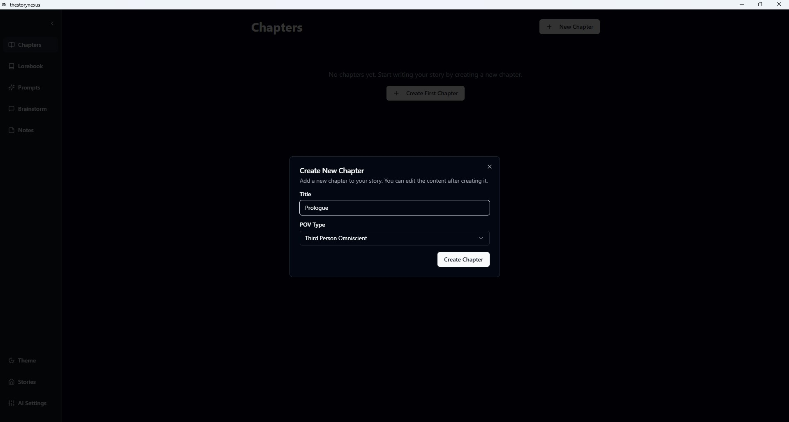

# Lyric Loom

A powerful AI-driven song writing desktop application built with Tauri, React, and TypeScript.

## Overview

Lyric Loom is a local-first desktop application designed for songwriters who want to leverage AI to enhance their creative process. It provides a comprehensive environment for crafting lyrics, organizing song structures, and developing musical ideas with the assistance of AI-powered tools.

## Key Features

- **Song Management**: Create and organize your songs with sections like verses, choruses, and bridges.
- **Rich Text Editor**: A powerful Lexical-based editor tailored for lyric writing.
- **Rhyming Engine**: Get instant rhyme and near-rhyme suggestions as you type (Ctrl+Space).
- **AI Lyric Suggestions**: Generate lyric ideas based on your song's themes, motifs, and existing text (Alt+L).
- **Song Elements**: Keep track of your song's core components, including themes, motifs, rhyme schemes, and chord progressions.
- **Avoid List**: Maintain a list of words and phrases to exclude from AI suggestions and rhyme results.
- **Local-First**: All your data is stored locally using IndexedDB with DexieJS, ensuring privacy and offline access.

## Getting Started for Songwriters

1.  **Create a New Song**: Click the "New Song" button on the main page to start your project.
2.  **Add Sections**: In the song dashboard, add sections like "Verse 1", "Chorus", etc.
3.  **Write Lyrics**: Open a section to start writing in the editor.
4.  **Get Rhymes**: Press `Ctrl+Space` after a word to see a list of rhymes.
5.  **Use AI Suggestions**: Press `Alt+L` to get an AI-powered suggestion for the next line.
6.  **Manage Song Elements**: Navigate to the "Song Elements" tab to define your song's themes, motifs, and other creative constraints.
7.  **Use the Avoid List**: Right-click any word in the editor and select "Add to Avoid List" to prevent it from appearing in future suggestions.

## Technology Stack

- **Frontend**: React, TypeScript, Tailwind CSS, Shadcn UI
- **State Management**: Zustand
- **Routing**: React Router v7
- **Storage**: IndexedDB with DexieJS
- **Text Editor**: Lexical
- **Desktop Framework**: Tauri v2
- **UI Components**: Shadcn UI, Lucide React icons
- **Notifications**: React Toastify

## Development

1. Clone the repository
2. Install dependencies:
   ```
   npm install
   ```
3. Start the development server:
   ```
   npm run dev
   ```

### Building

To build the application for production:

```
npm run build
```

To preview the production build:

```
npm run preview
```

To run Tauri commands:

```
npm run tauri
```

To run Tauri create debug release:

```
npm run tauri build -- --debug
```

To run Tauri create release build:

```
npm run tauri build
```

## Screenshots





## Project Structure

- `src/features/` - Main application features (songs, sections, prompts, ai, song-elements)
- `src/components/` - Reusable UI components
- `src/Lexical/` - Text editor implementation
- `src/types/` - TypeScript type definitions
- `src/services/` - Application services
- `src/lib/` - Utility functions and helpers
- `src/hooks/` - Custom React hooks
- `src/pages/` - Application pages
